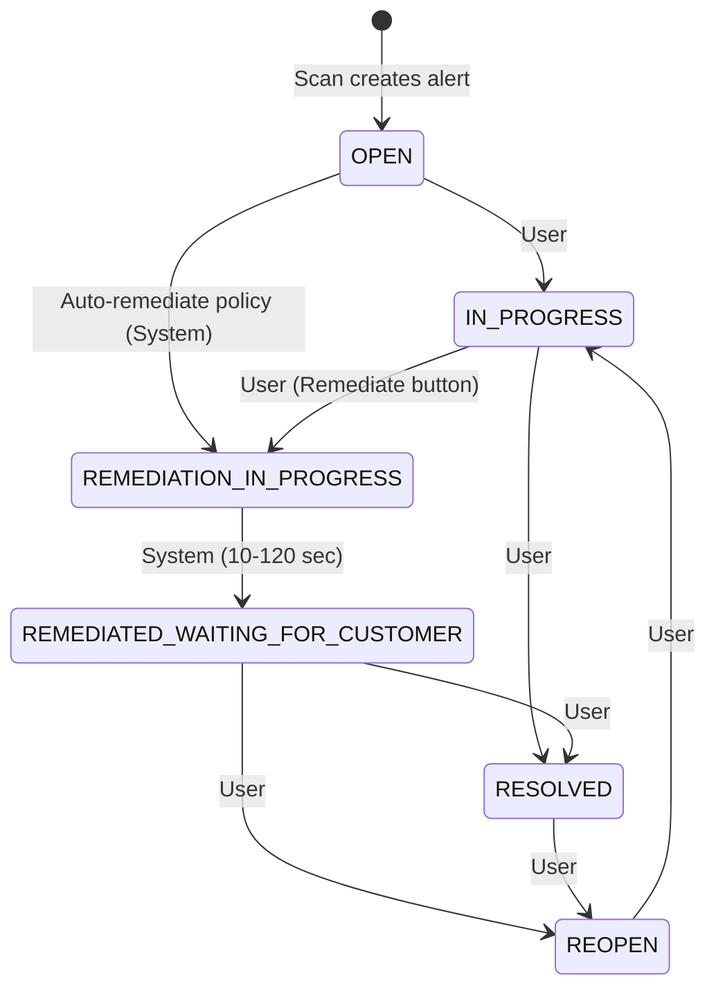

# Alert Status Flow Chart

This document describes all possible alert statuses and their valid transitions.

---

## Status Overview

| Status                            | Description                                   | User Can Change? |
| --------------------------------- | --------------------------------------------- | ---------------- |
| `OPEN`                            | New alert, not yet investigated               | ✅ Yes           |
| `IN_PROGRESS`                     | Under investigation                           | ✅ Yes           |
| `REMEDIATION_IN_PROGRESS`         | Remediation action triggered (auto or manual) | ❌ System only   |
| `REMEDIATED_WAITING_FOR_CUSTOMER` | Remediation complete (both auto and manual)   | ✅ Yes           |
| `RESOLVED`                        | Issue resolved and verified                   | ✅ Yes           |
| `REOPEN`                          | Previously resolved, re-opened                | ✅ Yes           |

> **Note:** `REMEDIATED_WAITING_FOR_USER_VERIFICATION` has been removed. Both auto and manual remediation now complete to `REMEDIATED_WAITING_FOR_CUSTOMER`.

---

## Flow Chart (ASCII)

```
                                    ┌─────────────────────────────────────────────────────┐
                                    │                                                     │
                                    │                    REOPEN                           │
                                    │                      │                              │
                                    │         ┌───────────┘                               │
                                    │         │                                           │
                                    │         ▼                                           │
┌──────────────┐              ┌─────────────────┐              ┌──────────────┐          │
│              │   User       │                 │    User      │              │          │
│     OPEN     │─────────────▶│   IN_PROGRESS   │─────────────▶│   RESOLVED   │──────────┘
│              │              │                 │              │              │
└──────────────┘              └─────────────────┘              └──────────────┘
       │                              │                               ▲
       │                              │                               │
       │ Auto-remediate               │ Remediate                     │
       │ (System only)                │ (Manual - button)             │
       │                              │                               │
       ▼                              ▼                               │
┌─────────────────────────────────────────────┐                       │
│                                             │                       │
│        REMEDIATION_IN_PROGRESS              │                       │
│                                             │                       │
└─────────────────────────────────────────────┘                       │
                    │                                                 │
                    │ System (10-120 sec)                             │
                    ▼                                                 │
┌─────────────────────────────────────────────┐                       │
│                                             │      User             │
│     REMEDIATED_WAITING_FOR_CUSTOMER         │──────────────────────▶│
│   (Both auto and manual remediation)        │                       │
└─────────────────────────────────────────────┘                       │
                    │
                    │ User
                    ▼
              ┌──────────┐
              │  REOPEN  │ ─────────────────┐
              └──────────┘                  │
                                            │ (loops back to
                                            │  IN_PROGRESS)
                                            ▼
```

> **Note:** Manual remediation (Remediate button) is only available when status is In Progress.

---

## Transition Matrix

### User-Initiated Transitions (via Status Dropdown)

| From Status                     | → To Status | Action                     |
| ------------------------------- | ----------- | -------------------------- |
| OPEN                            | IN_PROGRESS | User selects "In Progress" |
| REOPEN                          | IN_PROGRESS | User selects "In Progress" |
| IN_PROGRESS                     | RESOLVED    | User selects "Resolved"    |
| REMEDIATED_WAITING_FOR_CUSTOMER | RESOLVED    | User selects "Resolved"    |
| REMEDIATED_WAITING_FOR_CUSTOMER | REOPEN      | User selects "Reopen"      |
| RESOLVED                        | REOPEN      | User selects "Reopen"      |

### User-Initiated Transitions (via Remediate Button)

| From Status | → To Status             | Action                  |
| ----------- | ----------------------- | ----------------------- |
| IN_PROGRESS | REMEDIATION_IN_PROGRESS | User clicks "Remediate" |

> **Note:** Remediation is only available when status is In Progress.

### System-Initiated Transitions (Automatic)

| From Status             | → To Status                     | Trigger                                              |
| ----------------------- | ------------------------------- | ---------------------------------------------------- |
| (New Alert)             | OPEN                            | Scan creates alert                                   |
| OPEN                    | REMEDIATION_IN_PROGRESS         | Auto-remediate policy                                |
| REMEDIATION_IN_PROGRESS | REMEDIATED_WAITING_FOR_CUSTOMER | Both auto & manual remediation complete (10-120 sec) |

---

## Mermaid Diagram

Copy this into any Mermaid-compatible viewer (GitHub, Notion, etc.):



---

## Detailed Flow Descriptions

### Flow 1: Simple Investigation (No Remediation)

```
OPEN → IN_PROGRESS → RESOLVED
```

1. Alert created by scan → Status: **OPEN**
2. User starts investigation → Status: **IN_PROGRESS**
3. User confirms issue resolved → Status: **RESOLVED**

### Flow 2: Manual Remediation

```
OPEN → REMEDIATION_IN_PROGRESS → REMEDIATED_WAITING_FOR_CUSTOMER → RESOLVED
```

1. Alert created by scan → Status: **OPEN**
2. User clicks "Remediate" button → Status: **REMEDIATION_IN_PROGRESS**
3. System completes remediation (10-120 sec) → Status: **REMEDIATED_WAITING_FOR_CUSTOMER**
4. User verifies and resolves → Status: **RESOLVED**

### Flow 3: Auto-Remediation (Policy Configured)

```
OPEN → REMEDIATION_IN_PROGRESS → REMEDIATED_WAITING_FOR_CUSTOMER → RESOLVED
```

1. Alert created by scan with auto-remediate policy → Status: **OPEN** (briefly)
2. System auto-triggers remediation → Status: **REMEDIATION_IN_PROGRESS**
3. System completes auto-remediation (10-120 sec) → Status: **REMEDIATED_WAITING_FOR_CUSTOMER**
4. User verifies and resolves → Status: **RESOLVED**

> **Note:** If user resolves an auto-remediated alert, the next scan will re-detect it and create a new identical alert that goes through auto-remediation again.

### Flow 4: Reopen After Resolution

```
RESOLVED → REOPEN → IN_PROGRESS → RESOLVED
```

1. Alert was previously resolved → Status: **RESOLVED**
2. User reopens the alert → Status: **REOPEN**
3. User investigates again → Status: **IN_PROGRESS**
4. User resolves again → Status: **RESOLVED**

### Flow 5: Failed Remediation (Reopen)

```
... → REMEDIATED_WAITING_FOR_CUSTOMER → REOPEN → REMEDIATION_IN_PROGRESS → ...
```

1. Remediation completed → Status: **REMEDIATED_WAITING_FOR_CUSTOMER**
2. User finds issue still exists → Status: **REOPEN**
3. User triggers remediation again → Status: **REMEDIATION_IN_PROGRESS**
4. (Cycle continues)

---

## Status Colors (UI Reference)

| Status                          | Color  | Badge Style |
| ------------------------------- | ------ | ----------- |
| OPEN                            | Red    | Solid       |
| IN_PROGRESS                     | Blue   | Solid       |
| REMEDIATION_IN_PROGRESS         | Orange | Solid       |
| REMEDIATED_WAITING_FOR_CUSTOMER | Purple | Solid       |
| RESOLVED                        | Green  | Solid       |
| REOPEN                          | Red    | Outline     |

---

## API Enforcement

The backend enforces all transitions. Invalid transitions return:

```json
{
  "error": "Invalid status transition from OPEN to RESOLVED"
}
```

Status code: `400 Bad Request`
